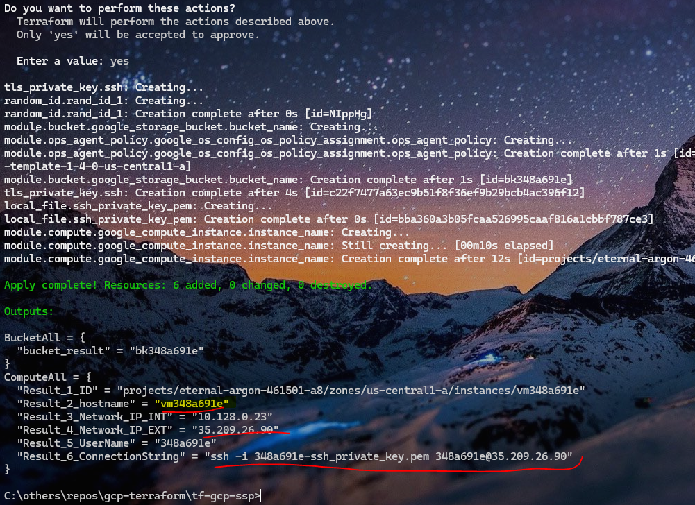

# Self Service Developer Portal - Google Cloud Platform : Using Terraform
## Demo of Terraform declarative files to provision GCP resources

### The script performs the following functions 
- [x] Provisions 1 X e1-micro VM & 1 x Cloud Storage Bucket
- [x] The VMs have 10G disk & default network routes + firewall Rules
- [x] Creates a key pair so that provisioned VMs are accessible through SSH clients. Public key metadata is attached to the VM whereas the Private key is generated in Terraform root folder
- [x] Outputs the VM names, bucket names, assigned IPs etc. The name suffixes have random ids generated at every terraform execution
- [x] (Optional) This script can also provision multiple compute instances & multiple cloud storage bucket from a key-value pair provided in the instance map
- [x] (Optional) The state file can be hosted to cloud storage bucket

### Additional Info:

- The script uses GCP service account KEY to provision the resources. Path to service account keyfile (json) is set in the environment variables GCLOUD_KEYFILE_JSON & GOOGLE_CLOUD_KEYFILE_JSON

### Output after terraform apply command is shown 

